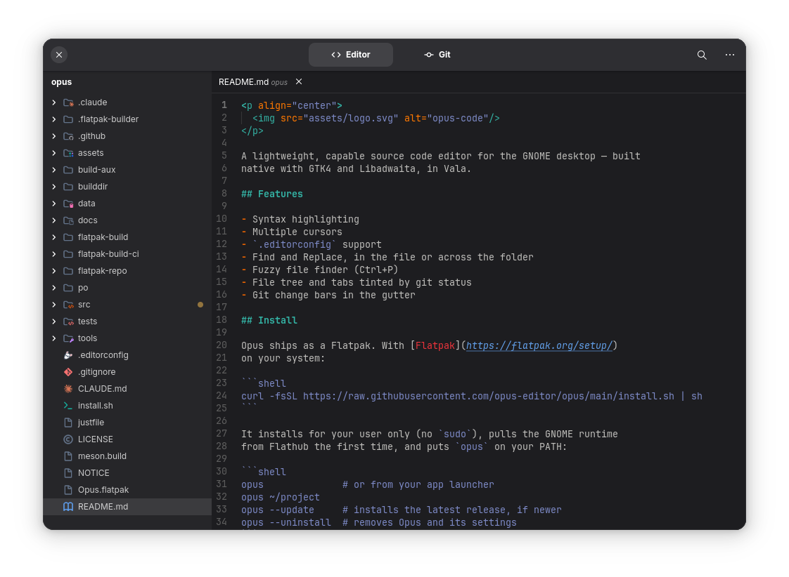

<p align="center">
  
</p>

<p align="center">
  <b id="app-version">0.1.3</b>
</p>

A lightweight, capable source code editor for the GNOME desktop — built
native with GTK4 and Libadwaita, in Vala.

## Preview

<p align="center">
  
</p>

## Features

- Syntax highlighting
- Multiple cursors
- `.editorconfig` support
- Find and Replace, in the file or across the folder
- Fuzzy file finder (Ctrl+P)
- File tree and tabs tinted by git status
- Git change bars in the gutter

## Supported languages

Highlighted out of the box:

- **Web:** HTML, CSS, SCSS, JavaScript, TypeScript, JSX, TSX, Vue,
  Svelte, Markdown
- **Backend:** Ruby, ERB, PHP, Java, Python, Go
- **Low level:** C, C++, Rust, Vala
- **Data:** JSON, YAML, TOML, XML, SQL
- **Tooling:** Bash, Dockerfile, Diff, Git commit messages, Meson

## Install

Opus ships as a Flatpak. With [Flatpak](https://flatpak.org/setup/)
on your system:

```shell
curl -fsSL https://raw.githubusercontent.com/opus-editor/opus/main/install.sh | sh
```

It installs for your user only (no `sudo`), pulls the GNOME runtime
from Flathub the first time, and puts `opus` on your PATH:

```shell
opus              # or from your app launcher
opus ~/project
opus --update     # installs the latest release, if newer
opus --uninstall  # removes Opus and its settings
```

Git features (status tints, change bars, gitignore-aware search) use
the `git` on your system. Settings live in
`~/.var/app/io.github.opus_editor.Opus/config/`.

## Prerequisites

To build from source:

- Vala (`valac`) 0.56+
- Meson 1.0+ and Ninja
- GTK4 (4.18+) and Libadwaita (1.7+) development headers
- `blueprint-compiler`
- `gettext` (the full package — `msgfmt`/`xgettext`, not just `gettext-base`)
- [`just`](https://github.com/casey/just), to run the commands below

On Debian/Ubuntu:

```shell
sudo apt install valac meson ninja-build libgtk-4-dev libadwaita-1-dev \
  blueprint-compiler gettext just
```

## Building

```shell
just build
just run [folder]
```

To build the Flatpak itself (needs `org.flatpak.Builder` from Flathub):

```shell
just flatpak   # builds and installs it for your user
just bundle    # exports out/flatpak/Opus.flatpak, what a release attaches
```

## Testing

```shell
just test
```

Before merging or releasing, `just ci` — see
[docs/DEVELOPMENT_WORKFLOW.md](docs/DEVELOPMENT_WORKFLOW.md).

## License

Copyright (c) 2026-present, Alexandre Magro

Opus is free software: you can redistribute it and/or modify it under
the terms of the GNU General Public License as published by the Free
Software Foundation, either version 3 of the License, or (at your
option) any later version. See [LICENSE](LICENSE).

Parts are ported from Visual Studio Code (MIT) and GNOME Text Editor
(GPL-3.0-or-later), and the bundled Symbols icon theme is MIT — see
[NOTICE](NOTICE) for the credits.
